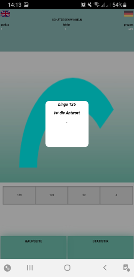

= Angle Guessing games With javascript

 This game has been developed with Cordova (HTML, CSS, JavaScript, SQL)
 to have a game that can be run on computer, android and iOS.  Canvas 
 Arc-circle has been used as a tool to realize this rate game.

= How to play ?
it is relatively simple. After downloading and installing the application, all you have to do is guess the exact angle that is displayed and at the end of the game you can look at the score, reset the score counter to zero and play again. This game is particularly suitable for people who have difficulties in geometry and for people who would like to learn how to estimate an angle just by looking at it.

== Download the application

To download the application, click on this link : link:https://github.com/noreme/Raetselraten/blob/master/MyAndroidSpielsApp.apk[download App].

